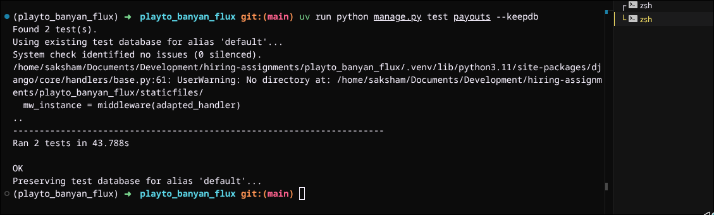

# Playto Payout Engine
Cross-border payment infrastructure for emerging markets.

This repository contains the core payout engine for Playto Pay, designed to handle merchant balance management, idempotent payout requests, and asynchronous bank settlement with strict data integrity.

## URLS
 - Server URL: https://playto-banyan-flux.onrender.com/
 - Frontend URL: https://playto-banyan-flux-0xsaksham.netlify.app/

## 🏗 System Architecture
The system is built on a **Double-Entry Ledger pattern** to ensure absolute financial accuracy.

*   **Financial Integrity:** All currency is handled in `BigIntegerField` (paise) to eliminate floating-point math errors.
*   **Race-Condition Protection:** We utilize PostgreSQL's row-level locking (`SELECT FOR UPDATE`) to prevent "double-spend" scenarios during concurrent payout requests.
*   **Fault Tolerance:** Idempotency is enforced at the database level via a `UniqueConstraint` on `(merchant_id, idempotency_key)`, allowing clients to safely retry requests without fear of duplicate payouts.
*   **Atomic State Machine:** All state transitions (e.g., reverting a failed payout to return funds) are encapsulated in `transaction.atomic()` blocks to ensure the balance and ledger never drift.

## 🚀 Key Technical Decisions

| Challenge | Solution | Why? |
| :--- | :--- | :--- |
| **Concurrency** | `select_for_update()` | Prevents overdrawing by serializing write access to a merchant's balance row. |
| **Integrity** | Ledger-based model | Every balance change is tied to a `Transaction` record; the ledger is the source of truth, not the `Merchant.balance` cache. |
| **Idempotency** | Unique DB Index | Prevents network-level retries from creating duplicate payouts; provides a 24-hour window for safe client retries. |
| **Infrastructure** | PostgreSQL (Neon) | Switched from SQLite to Postgres to support native row-level locking primitives required for high-concurrency Fintech. |

## 🛠 Tech Stack
- **Framework:** Django 5.0 + Django REST Framework
- **Task Queue:** Celery + Redis
- **Database:** PostgreSQL (Neon Serverless)
- **Tooling:** `uv` for lightning-fast dependency management and reproducible builds.

## ⚙️ Development Setup

1. **Install uv** (if not present):
   ```bash
   curl -LsSf https://astral.sh/uv/install.sh | sh
   ```
2. **Install dependencies:**
   ```bash
   uv sync
   ```
3. **Configure Environment:**
   Create a `.env` file in the root directory:
   ```env
   DATABASE_URL=postgres://<user>:<password>@<host>/<dbname>?sslmode=require
   ```
4. **Migrate & Seed:**
   ```bash
   uv run python manage.py migrate
   uv run python manage.py seed_data
   ```
5. **Run Verification Tests:**
   ```bash
   uv run python manage.py test payouts --keepdb
   ```

## 🧪 Testing Strategy
To verify the system's robustness, I implemented sequential integration tests using `TransactionTestCase` that validate:
1. **Double-Spend Prevention:** Ensuring that if two identical requests arrive, only one is processed and the balance remains consistent.
2. **Idempotency Guarantee:** Ensuring repeated requests with the same key return the original payout status without duplicating side effects.



***This payout engine is designed to be a critical component of Playto Pay's mission to provide reliable, scalable cross-border payment solutions for emerging markets. The architecture prioritizes financial integrity and operational resilience, ensuring that merchants can trust the system with their funds.***
